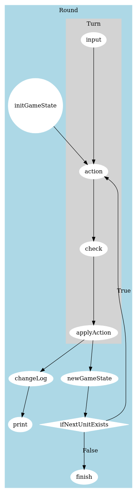
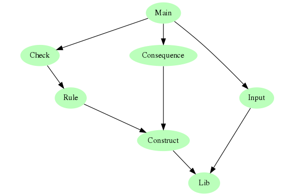

## UTTI Design
Utti is a turn based strategy game. One game continue for 500 rounds. One round consists of one action performed by each unit on the gameboard, including new units created during the round. The two teams namely Red and Blue alternate between taking actions. The unit performing the turn is selected from a turn queue which is recreated for each round and is also modified by some actions. An action can modify the state of the game, and is only applied if it passes a check composed of several rules.

### Game loop - round

### GameState
`GameState {gamequeue :: Queue, gamegold :: Gold, gameunitboard :: Map Pos Unit}`
GameState wraps all the structures that can change by applying an action namely,
1. Players' gold reserves
2. Unit turn queue
3. Units on the board

### Action
`Action {actionname :: ActionName, actionpos :: Maybe Pos, actionunit :: Unit}`
An action consists of a name, the unit performing the action and the position where the action will be performed (if required). This information allows checks to determine if the action can be performed on the current game state.

### Rule
`anyRule :: GameState -> Action -> Maybe Action`
A rule takes the curent game state and an action. It checks if the action is valid for the state and returns `Just` the action else it returns `Nothing`. The `Maybe` return value allows rules to be composed together to create a check for an action of a particular type.

### Consequence
`anyConsequence :: Action -> GameState -> Writer [String] GameState`
A consequence changes the game state, according to the action and logs the changes in a writer monad. This method allows a single consequence to make multiple changes on the game state.

### Module inter-dependencies

